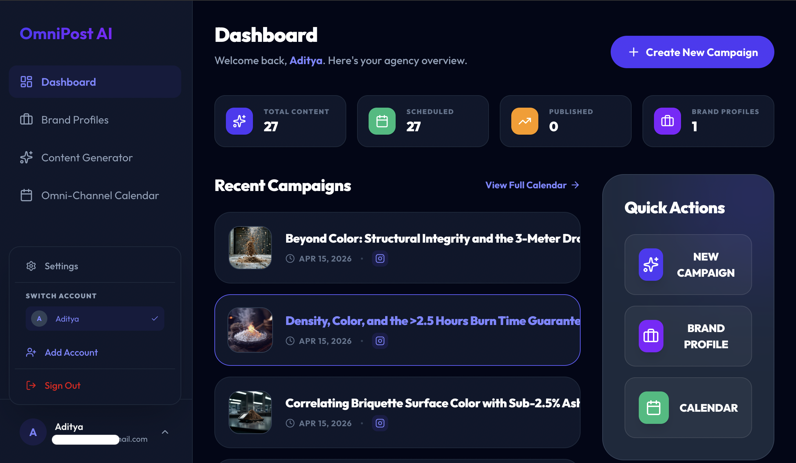
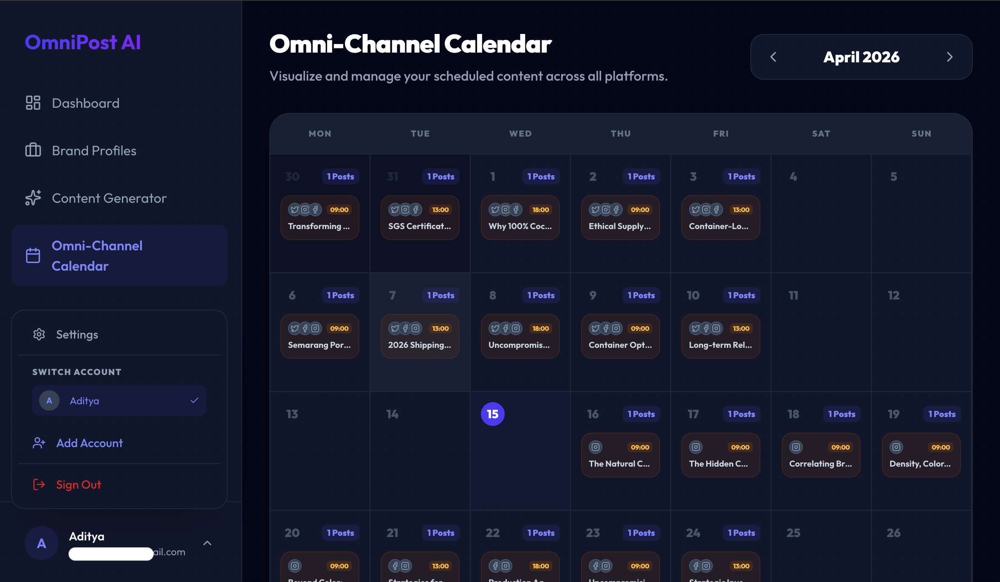
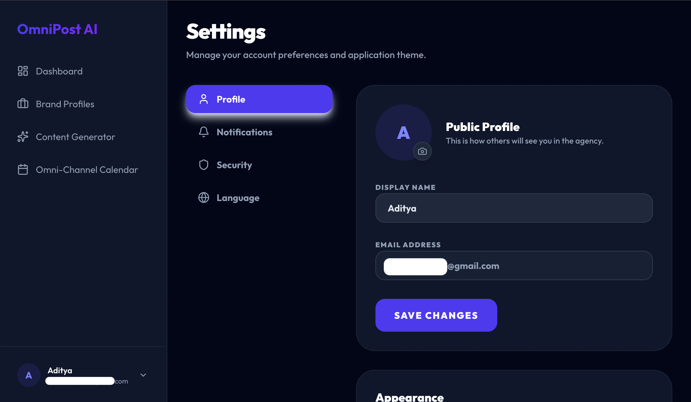
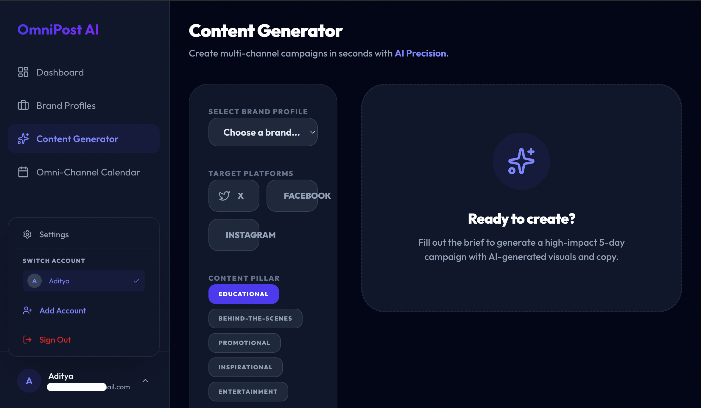

# OmniPost AI 🚀

OmniPost AI is an intelligent social media management dashboard. Designed for digital agencies and B2B brands, it automates multi-channel marketing by generating tailored AI copy and visuals, managing distinct brand personas, and scheduling omni-channel campaigns to scale content production effortlessly.

## 📖 Project Overview

Designed with agency workflows in mind, OmniPost AI eliminates the friction between content ideation and publishing. By leveraging advanced generative AI to create both copy and visuals tailored to specific brand personas, users can maintain a consistent, high-quality posting streak across multiple platforms from a single, centralized hub.

## ✨ Key Features

* **AI Content Generator:** Quickly generate high-impact, 5-day campaign briefs—including custom copy and imagery—powered by the Gemini API. 
* **Brand Profile Management:** Create and manage distinct AI personas and brand identities (e.g., B2B Export, B2C Retail) to ensure all generated content matches the exact tone and professional requirements of the client.
* **Omni-Channel Calendar:** Visualize and manage your content pipeline seamlessly across X (Twitter), Facebook, and Instagram.
* **Analytics Dashboard:** Get a bird's-eye view of your agency's output, tracking total generated content, scheduled posts, and published campaigns.
* **Customizable UI/UX:** Sleek, modern interface with built-in Dark and Light mode toggles for optimal user experience.

## 📸 Platform Previews

### 1. Main Agency Dashboard
Get a bird's-eye view of your agency's output, tracking total generated content, scheduled posts, and recent campaign performance.


### 2. AI Content Generation
Quickly generate high-impact, 5-day campaign briefs—including custom copy and imagery—powered by the Gemini API.


### 3. Application Settings & Preferences
Sleek, modern interface with customizable user profiles and built-in Dark/Light mode toggles for optimal user experience.


### 4. Omni-Channel Calendar
Visualize and manage your scheduled content pipeline across all platforms. Keep track of posting streaks and plan multi-day campaigns with ease.


## 🛠️ Tech Stack & Integration

* **AI Engine:** Gemini API (Text & Vision capabilities)
* **Environment:** Node.js
* **Package Manager:** npm

## 🎯 Target Audience & Use Case

This platform is specifically built for:
1. **Digital Marketing Agencies** managing multiple client portfolios.
2. **B2B & Export Businesses** (like coal/briquette manufacturing) needing consistent, professional international outreach.
3. **Freelance Social Media Managers** looking to scale their operations using AI automation.

## 🚀 Getting Started

Follow these steps to set up and run the dashboard locally on your machine.

### **Prerequisites**
* Node.js

### **Run Locally**

1. Install dependencies:
   ```bash
   npm install

2. Set the GEMINI_API_KEY in .env.local to your active Gemini API key.

3. Run the app:
   ```bash
   npm run dev